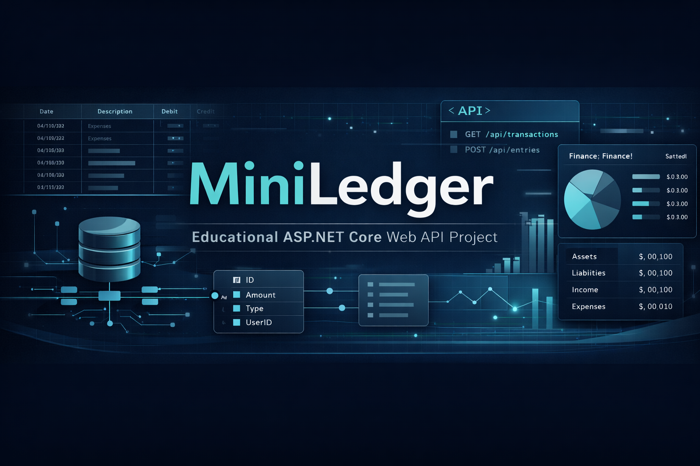

# MiniLedger



MiniLedger is an educational ASP.NET Core Web API project inspired by real accounting systems.

It is built step by step to help developers learn backend development from intermediate to advanced level through a realistic accounting domain.

---

## Why MiniLedger?

MiniLedger is not just a simple CRUD project.

It is designed as a practical learning project that gradually evolves through multiple phases:

- Web API fundamentals
- Business rules and validation
- Authentication and authorization
- Clean Architecture and CQRS
- Testing
- Performance and production readiness

---

## Learning Goals

- Build clean ASP.NET Core Web APIs
- Learn Entity Framework Core in real scenarios
- Apply layered design and separation of concerns
- Implement realistic accounting rules
- Create a public GitHub portfolio project
- Prepare a strong technical base for advanced backend topics

---

## Project Roadmap

### Phase 1 - Web API Fundamentals
- Project structure
- ASP.NET Core Web API basics
- Entities and DTOs
- EF Core setup
- CRUD operations
- Middleware
- Logging
- Swagger

### Phase 2 - Business Rules and Querying
- Stronger business validation
- Filtering
- Sorting
- Pagination
- Better API responses

### Phase 3 - Authentication and Authorization
- JWT authentication
- Role-based authorization
- Protected endpoints

### Phase 4 - Clean Architecture and CQRS
- Domain layer
- Application layer
- Infrastructure layer
- MediatR
- Commands and queries

### Phase 5 - Testing
- Unit testing
- Integration testing
- Validation testing

### Phase 6 - Performance and Production Readiness
- Caching
- Logging improvements
- Optimization
- Deployment preparation

---

## Repository Structure

```plaintext
src/    - source code
docs/   - guides, phase documentation, learning materials
tests/  - automated tests
